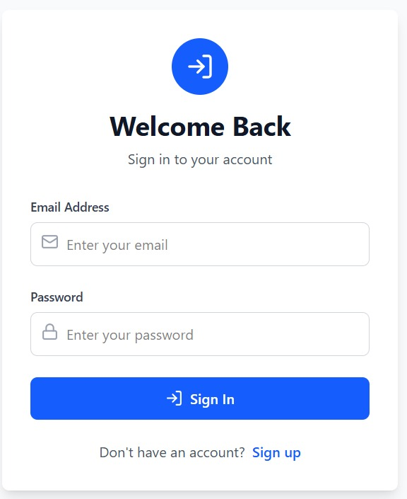
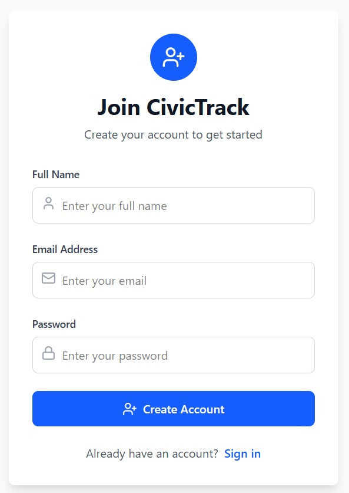
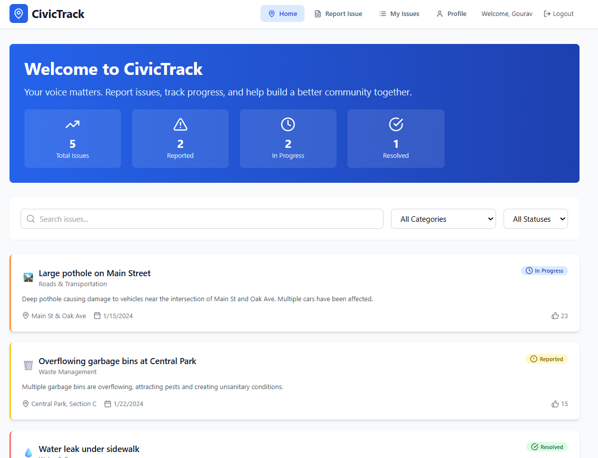
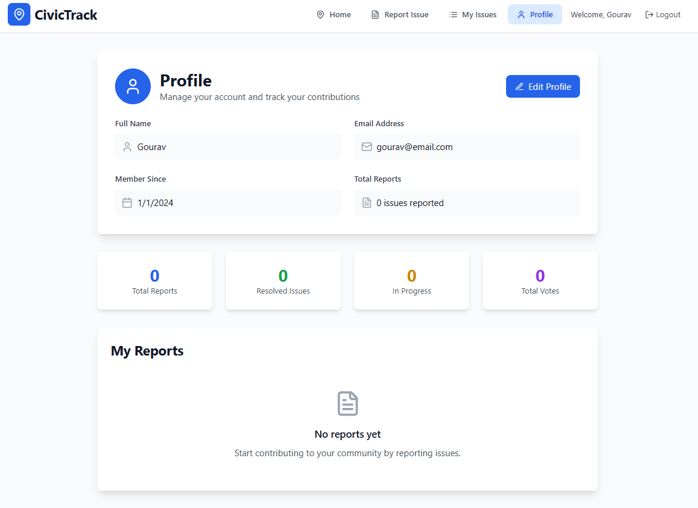
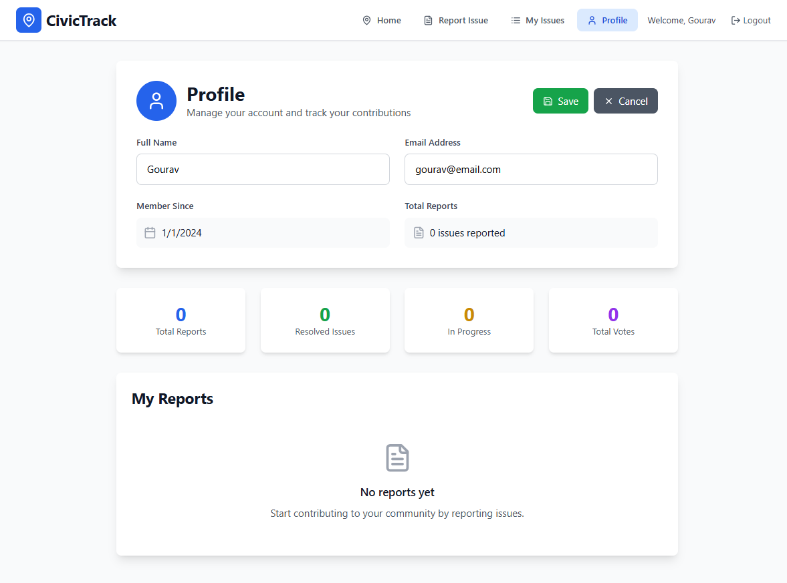
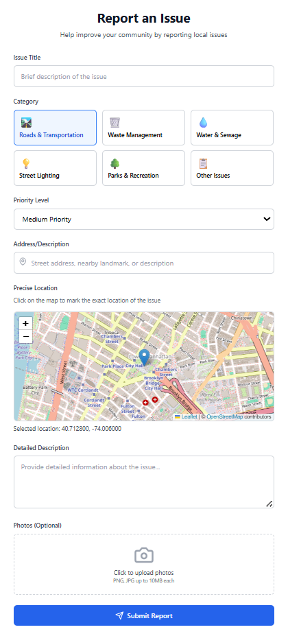

# 🌍 CivicTrack – Report. Resolve. Rebuild. 🚧


- CivicTrack is your neighborhood’s voice. Report civic issues like potholes, garbage, or water leaks with just a few taps. Track progress, stay updated, and join hands in building a cleaner, safer, and smarter community — one report at a time.
---
## 👥 Team Details
 
**Team Members:**
- Arman 
- Gourav Kumar  
- Prateek Sharma  
- Mohd Asheer


## Screenshots
---
### Login/Signin Page
---

---
### Create Account / Signup Page
---

### Home Page
---

---
### Profile Page
---

---
### Edit Profile
---

---
### Report Issue page
---

---

## 🚀 Features

### 📝 Easy Issue Reporting
- 🏷️ Report civic issues like potholes, garbage, water leaks, and more.
- 🖊️ Add a **title**, **description**, and up to **3–5 photos**.
- 📂 Select a relevant **category** for better classification.

### 📍 Location-Based Visibility
- 🌐 View issues reported only within a **3–5 km radius** (via GPS or manual location).
- 🧭 Keeps user experience hyper-local and focused.

### 📢 Status Tracking & Notifications
- 🔄 Track each issue through the lifecycle:  
  `Reported → In Progress → Resolved`.
- 🔔 Receive **real-time notifications** on status changes.
- 🕒 View detailed **status change logs** with timestamps.

### 🗺️ Interactive Map View
- 📌 See all nearby issues pinned on an interactive **map**.
- 🔎 Filter issues by:
  - ✅ **Status**: Reported, In Progress, Resolved
  - 🧹 **Category**: Roads, Lighting, Water, Cleanliness, etc.

### 🚨 Spam Reporting & Moderation
- 🚩 Flag **spam** or **irrelevant** reports.
- 🙈 Reports flagged by multiple users are **auto-hidden**.
- 🛡️ **Admins** can review flags, approve or reject, and **ban** abusers.

### 👥 Role-Based Access
- 👤 **Users** (anonymous or verified): Can report issues, track updates, and flag reports.
- 🧑‍💼 **Admins**: Manage flagged reports, access analytics, and moderate content.

### 📊 Analytics Dashboard
- 🧮 Track total number of reports
- 🔥 Identify most reported issue categories
- 📈 Monitor flagged issues and user activity


---


## 📦 Project Structure
```
📁 CivicTrack---OdooXMohali/
│
├── 📁 backend/
│    └── 📁 src/
│       ├── 📁 db/
│       │   └── index.js
│       ├── 📁 controllers/
│       │   ├── issues.controller.js
│       │   └── user.controller.js
│       ├── 📁 middlewares/
│       │   ├── auth.middleware.js
│       │   └── multer.middleware.js
│       ├── 📁 models/
│       │   ├── issues.models.js
│       │   └── user.models.js
│       ├── 📁 routes/
│       │   ├── issues.routes.js
│       │   ├── doctorRoute.js
│       │   └── user.routes.js'
│       ├── 📁 routes/
│       │   ├── ApiError.js
│       │   ├── ApiResponse.js
│       │   ├── asynHandler.js
│       │   └── cloudinary.js
│       ├── .env
│       ├── app.js
│       ├── constants.js
│       └── index.js
│
├── 📁 frontend/
│   ├── 📁 public/
│   │   └── favicon.svg
│   ├── 📁 src/
│   │   ├── 📁 assets/
│   │   ├── 📁 components/
│   │   │   ├── Auth.jsx
│   │   │   ├── Dashboard.jsx
│   │   │   ├── Handler.jsx
│   │   │   ├── IssueCard.jsx
│   │   │   ├── IssueDetail.jsx
│   │   │   ├── Profile.jsx
│   │   │   └── ReportForm.jsx
│   │   ├── 📁 utils/
│   │   │   └── APIRoutes.jsx
│   │   ├── App.jsx
│   │   ├── index.css
│   │   └── main.jsx
│   ├── .env
│   └── index.html
│   
└── README.md
```

---

## 🛠 Technologies Used

### 🔧 Backend
- Node.js
- Express.js
- Mongo DB
- Cloudinary
- Multer
- JWT Authentication

### 🎨 Frontend & Admin Panel
- React.js
- Tailwind CSS 
- React Router DOM
- Axios
- lucide-react
- react-toastify


## 🚀 Installation Guide

Follow these steps to set up **CivicTrack** locally in your editor (VS Code or any IDE).

---

### 🧰 Prerequisites
```
- Node.js (v16 or higher)  
- MongoDB (local or MongoDB Atlas)  
- Cloudinary account  
- Git  
```
---

### 🔧 1. Clone the Repository
```bash
git clone https://github.com/pratsha2005/CivicTrack---OdooXMohali.git
cd CivicTrack---OdooXMohali
```
### ⚙️ 2. Backend Setup (inside /server)
```bash
cd backend
npm install
```
Create a .env file and add:
```bash
PORT = ""
MONGODB_URI= ""
CORS_ORIGIN = ""
CLOUDINARY_CLOUD_NAME=''
CLOUDINARY_API_KEY=''
CLOUDINARY_API_SECRET=''

```
Start the backend server:
```bash
npm run dev
```
### 💻 3. Frontend Setup (inside /client)
```bash
cd ../frontend
npm install
```
Create a .env file and add:
```bash
VITE_BACKEND_URL = ""
```
Start the frontend:
```bash
npm run dev
```
---

## 📖 Usage Guide

Follow these steps to report and track civic issues in your area:

### 1️⃣ Register / Login
- 🔐 Sign up or log in to access the full functionality.
- 🙈 Anonymous users can still report issues (with limited tracking).

### 2️⃣ Report an Issue
- 📝 Click on **"Report Issue"**.
- 🏷️ Enter a **title** and **short description**.
- 🗂️ Select a **category** (e.g., Roads, Lighting, Water).
- 📸 Upload up to **3–5 photos** for clarity.
- 📍 Use GPS or select your **location manually**.

### 3️⃣ Track Issue Status
- ⏳ View the issue’s current status:  
  `Reported → In Progress → Resolved`.
- 🔔 Receive **notifications** whenever the status is updated.
- 🕓 Check **status history** and timestamps on the issue page.

### 4️⃣ Explore the Map
- 🗺️ View nearby reported issues on the map.
- 🔎 Use filters:
  - Status (Reported, In Progress, Resolved)
  - Category
  - Distance (1 km, 3 km, 5 km)

### 5️⃣ Flag Spam or Irrelevant Issues
- 🚩 If you see false or irrelevant reports, click **"Flag as Spam"**.
- 🙅 Reports flagged multiple times are **auto-hidden** for review.

### 6️⃣ Admin Features (For Admin Users)
- 🛠️ Review and manage flagged issues.
- 👥 Ban misbehaving users if needed.
- 📊 View analytics dashboard to monitor city issues.


---

## 📡 API Endpoints
Below is the list of core API routes used in the CivicTrack application for user authentication, issue reporting, and location-based operations.


| Route Name                 | Method | Endpoint                                               |
|---------------------------|--------|--------------------------------------------------------|
| Login User                | POST   | `${port}/api/v1/users/login`                          |
| Register User             | POST   | `${port}/api/v1/users/register`                       |
| Logout User               | POST   | `${port}/api/v1/users/logout`                         |
| Refresh Token             | GET    | `${port}/api/v1/users/refresh-token`                  |
| Get Current User Profile  | GET    | `${port}/api/v1/users/profile`                        |
| Update Name & Avatar      | PATCH  | `${port}/api/v1/users/update-profile`                 |
| Update Location           | PATCH  | `${port}/api/v1/users/update-location`                |
| Register Issue            | POST   | `${port}/api/v1/issues/register-issue`                |
| Get All Issues            | GET    | `${port}/api/v1/issues/getAllIssues`                  |
| Get Nearby Issues         | GET    | `${port}/api/v1/issues/getNearbyIssues/:radius`       |


📌 More endpoints available in API documentation.

---

## 🤝 Contributing

We welcome contributions to improve **CivicTrack**!

### 🧩 How to Contribute

#### 1. Fork the Repository  
   Click the **Fork** button on the top right of this page.

#### 2. Clone Your Fork 
   Open terminal and run:
   ```bash
   git clone https://github.com/pratsha2005/CivicTrack---OdooXMohali.git
   cd CivicTrack---OdooXMohali
   ```

#### 3. Create a feature branch:
   Use a clear naming convention:
   ```bash
   git checkout -b feature/new-feature
   ```
   
#### 4. Make & Commit Your Changes
   Write clean, documented code and commit:
   ```bash
   git add .
   git commit -m "✨ Added: your change description"
   ```
   
#### 5. Push to GitHub & Submit PR
   ```bash
   git push origin feature/your-feature-name
   ```
#### 6. Then go to your forked repo on GitHub and open a Pull Request.

---
